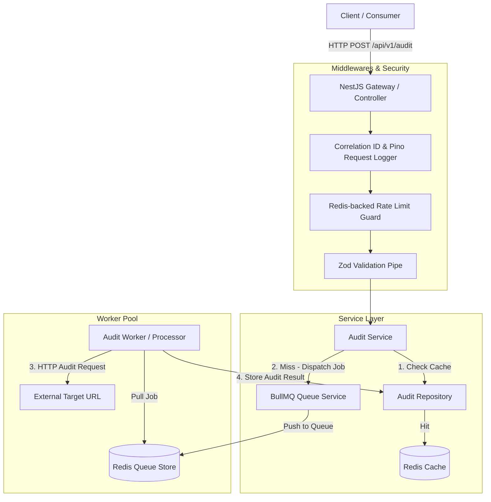
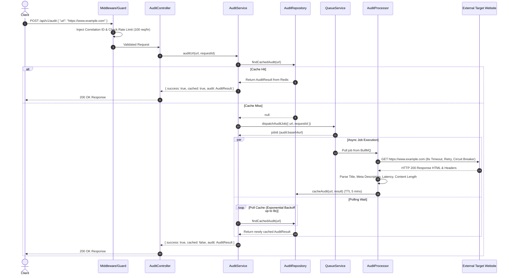

# Page Pulse — System Architecture Documentation

## 1. High-Level Architecture

Page Pulse is designed as an event-driven, production-grade URL Auditing microservice using modern Node.js 22, NestJS, BullMQ, and Redis.



---

## 2. Sequence Diagrams

### Audit Request Flow (Cache Miss vs Cache Hit)



---

## 3. Data Flow Diagrams

### Queue Flow & Deduplication

```mermaid
flowgraph LR
    A[Incoming Request: URL] --> B{Calculate Deterministic JobId}
    B --> C["jobId = audit:base64(url)"]
    C --> D{BullMQ Enqueue}
    D -->|New JobId| E[Added to Waiting Queue]
    D -->|Existing Active JobId| F[Deduplicated - Reuses Existing Job]
    E --> G[Worker Pool - Concurrency: 20]
    G --> H[Process HTTP Fetch]
    H --> I[Write Result to Redis Key: cache:audit:hash]
```

### Cache Flow

```mermaid
flowgraph TD
    A[URL Key Request] --> B[Redis Key: cache:audit:<base64url>]
    B -->|EXISTS| C[Deserialize JSON]
    C --> D[Increment Cache Hit Metric]
    D --> E[Return Audit Object]
    B -->|NOT EXISTS| F[Increment Cache Miss Metric]
    F --> G[Dispatch BullMQ Worker]
    G --> H[Fetch & Cache Result with EXPIRE TTL]
```

---

## 4. Deployment Diagram

```mermaid
graph TB
    subgraph Container Host / Kubernetes
        subgraph Ingress Layer
            ALB[Application Load Balancer / Nginx]
        end

        subgraph App Containers (Blue/Green Deployment)
            App1[Page Pulse Container 1]
            App2[Page Pulse Container 2]
        end

        subgraph Infrastructure
            Redis[(Redis 7 Cluster / Standalone)]
        end
    end

    ALB -->|Port 3000| App1
    ALB -->|Port 3000| App2
    App1 -->|Port 6379| Redis
    App2 -->|Port 6379| Redis
```

---

## 5. Technology Decision Records (TDR)

### TDR-001: NestJS Framework Selection

- **Selected**: NestJS
- **Alternative Considered**: Express.js, Fastify
- **Reason for Selection**: NestJS provides an enterprise-grade modular architecture, native Dependency Injection, clean separation of concerns, and built-in support for guards, filters, pipes, and microservice modules. Fastify and Express require writing custom architectural boilerplate.

### TDR-002: BullMQ Queue Engine

- **Selected**: BullMQ
- **Alternative Considered**: Bull (v3), AWS SQS, Raw Redis RPUSH/LPOP
- **Reason for Selection**: BullMQ is built for Node.js on top of Redis streams/hashes. It natively supports worker concurrency control, exponential backoff retries, job deduplication via custom `jobId`, dead-letter queues, and automatic cleanup of completed jobs. Raw Redis lacks retry semantics and concurrency controls.

### TDR-003: Zod Validation Engine

- **Selected**: Zod
- **Alternative Considered**: class-validator, Joi
- **Reason for Selection**: Zod guarantees runtime type safety, schema composability, zero-dependency lightweight execution, and seamless TypeScript type inference without relying on experimental metadata reflection decorators (`reflect-metadata`).

### TDR-004: Pino Structured Logger

- **Selected**: Pino
- **Alternative Considered**: Winston, Morgan
- **Reason for Selection**: Pino is up to 5x faster than Winston, produces JSON-first structured logs natively, supports stream redaction for sensitive fields (auth headers, cookies), and integrates directly with `pino-http` for request logging.

### TDR-005: Redis Storage Strategy

- **Selected**: Redis 7
- **Alternative Considered**: Memcached, In-Memory Node Map
- **Reason for Selection**: Redis serves as a multi-purpose infrastructure backbone: backing BullMQ queues, providing atomic rate limiting counters via `INCR`/`EXPIRE`, and caching audit results. In-memory maps do not survive restarts or scale horizontally across multiple container instances.
